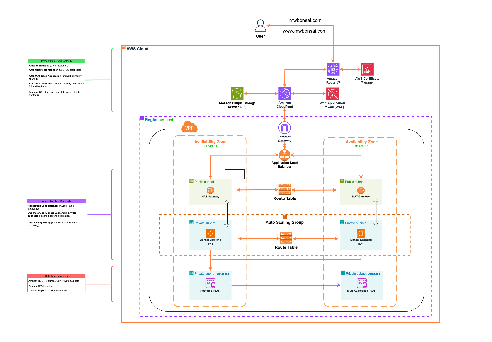
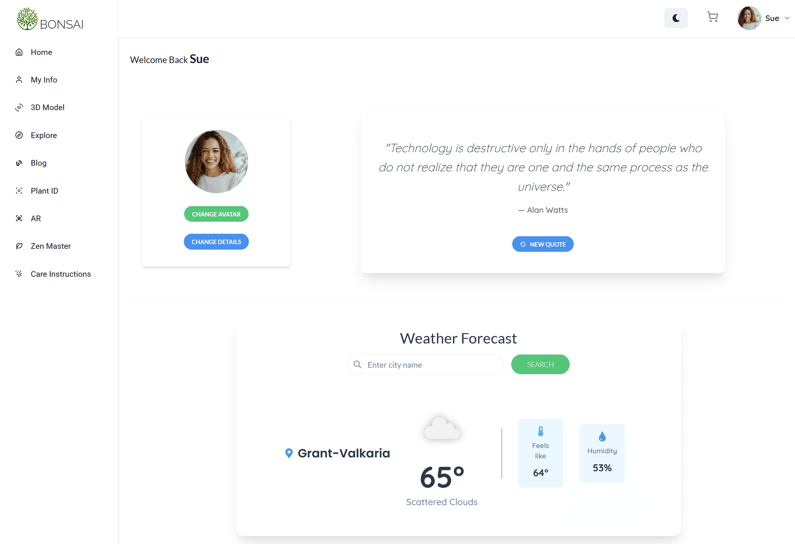
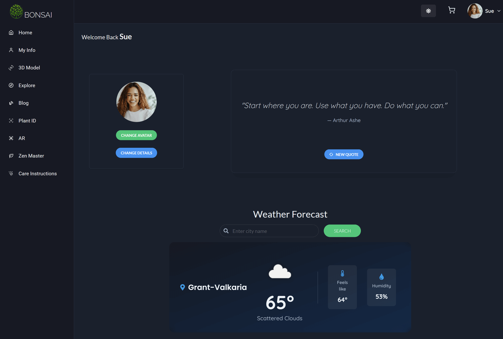
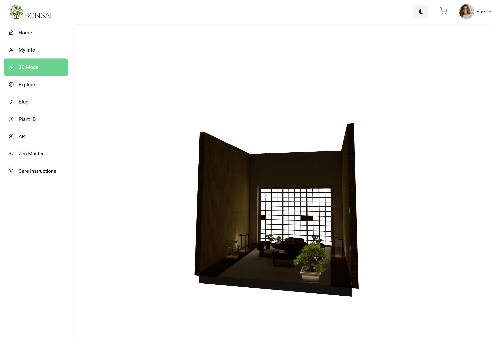
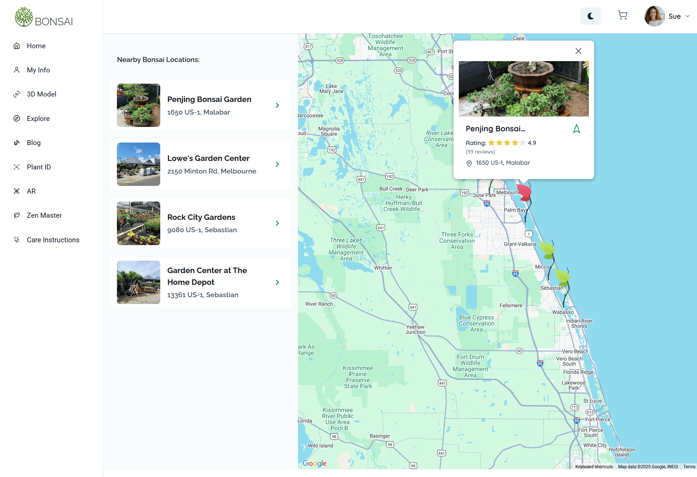
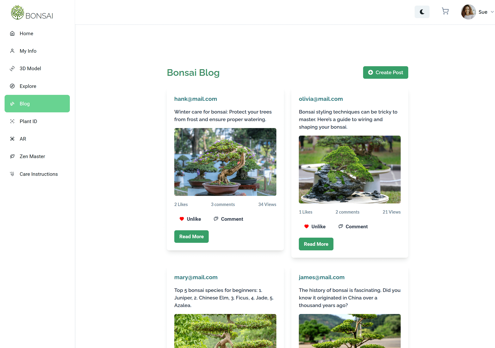
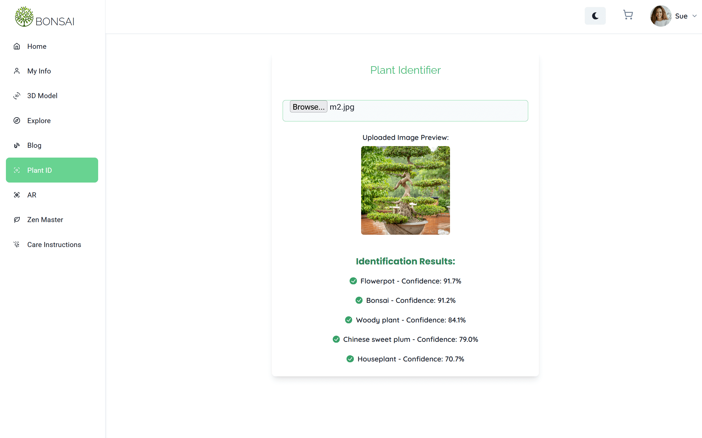
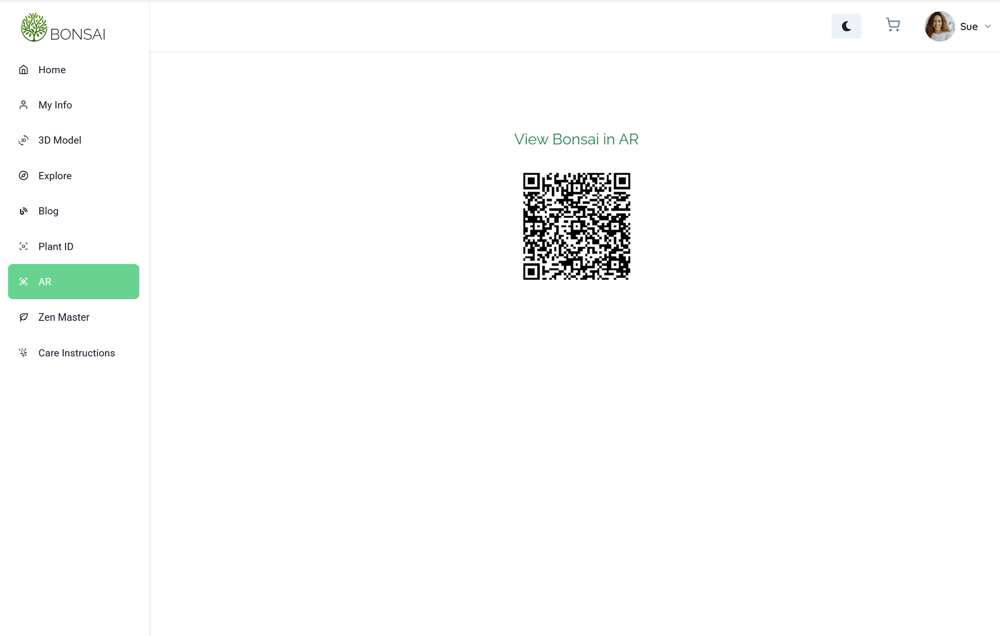
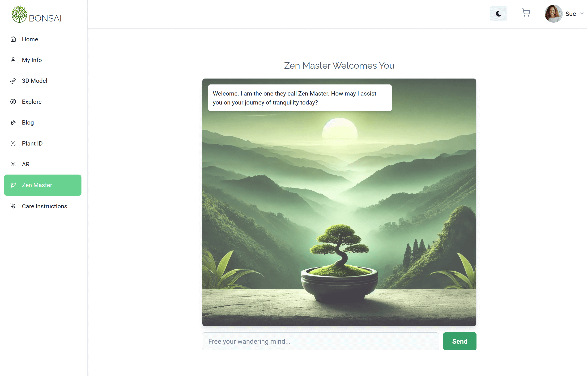

# 🌱 Bonsai

<div align="center">
  
</div>
<br><br><br>

Welcome to **Bonsai**, a full-stack web application that offers a seamless
eCommerce experience for bonsai enthusiasts. The platform allows users to
browse, purchase, and explore curated bonsai plants, accessories, and
information.

Bonsai combines cutting-edge technology with a tranquil design to create the
ultimate platform for bonsai lovers. <br><br>

## 🌐 Live Demo

Check out the live version of the app:
**[www.mwbonsai.com](https://www.mwbonsai.com)**.

---

<br>

## 🚀 Built With

### **Frontend**


### **Backend**


### **Third-Party APIs**


---

<br>

## 🎯 Features

- 📱 **Responsive Design:** Built with React and styled using Chakra UI for a
  beautiful and intuitive user experience across both mobile and desktop
  devices.
- 🛒 **Interactive Components:** Includes an elegant shopping cart, dynamic
  product filtering, and search functionality.
- 💳 **PayPal API:** Secure payment API integration.
- 🧘 **Zen Quotes API:** Generate inspirational quotes on demand.
- 🤖 **OpenAI API:** For an intelligent chatbot experience.
- ☁️ **Weather API:** To check local conditions for optimal bonsai care.
- 📍 **Location Services:** Integration with Google Maps API to find nearby
  bonsai nurseries, gardens, and stores.
- 🌿 **3D and Augmented Reality:** View and manipulate bonsai plants in 3D and
  Augmented Reality using Three.js, React Three Fiber.
- 📝 **Blog Integration:** Create, Read, and interact with blog posts from other
  users.
- 🛠️ **Django-Powered Backend:** A robust and secure API backend built with
  Django and Django REST Framework.
- 🖼️ **Image Management:** Efficient handling of product and user-uploaded
  images using AWS S3.
- 🔐 **Authentication:** Secure user authentication and authorization powered by
  JWT. <br><br><br>

## 🛠 Installation & Setup

## 📌 Prerequisites

Before setting up the project, ensure you have the following installed:

### **Frontend Prerequisites:**

- [Node.js](https://nodejs.org/) (v16+ recommended)
- [npm](https://www.npmjs.com/)

### **Backend Prerequisites:**

- [Python 3.9+](https://www.python.org/downloads/)
- [PostgreSQL 13+](https://www.postgresql.org/download/)
- [Virtual Environment (`venv`)](https://docs.python.org/3/library/venv.html)
- [AWS CLI (for S3 integration)](https://aws.amazon.com/cli/)

---

### **Clone the Repository**

```bash
git clone https://github.com/mikhail-w/bonsai.git
cd bonsai
```

### **Frontend Setup**

```bash
cd frontend
npm install
npm run dev
```

### **Backend Setup**

```bash
cd backend
python -m venv venv
source venv/bin/activate
pip install -r requirements.txt
```

### **Setup Database**

```bash
sudo -u postgres psql
CREATE DATABASE bonsai_store;
CREATE USER postgres WITH PASSWORD 'password';
ALTER USER postgres WITH SUPERUSER CREATEROLE CREATEDB;
```

### **Apply Migrations & Load Data**

```bash
python manage.py makemigrations
python manage.py migrate
```

**Important Note on Data Loading Order:**
When loading fixtures, you must follow this specific order to maintain referential integrity:

```bash
# First load users (since other models depend on them)
python manage.py loaddata users.json

# Then load products
python manage.py loaddata products.json

# Then load posts
python manage.py loaddata posts.json

# Then load reviews (which depend on users and products)
python manage.py loaddata reviews.json

# Finally load comments (which depend on users and posts)
python manage.py loaddata comments.json
```

**Note:** If you encounter foreign key constraint errors, ensure that the user IDs in your fixture files match the actual user IDs in your database. The reviews.json file should only reference user IDs that exist in your users.json file.

### **Run the Server**

```bash
python manage.py runserver
```

---

## 📂 Environment Variables

Ensure you configure your environment variables for both the **frontend** and
**backend**.

### **Frontend (`.env` in `frontend/`)**

```env
VITE_API_URL=your_backend_api_url
VITE_WEATHER_API_KEY=your_open-weather_api_key
VITE_PAYPAL_CLIENT_ID=your_paypal_client_id
VITE_GOOGLE_MAPS_API_KEY=your_google_maps_api_key
VITE_GOOGLE_CLOUD_VISION_API_KEY=your_google_cloud_vision_api_key
VITE_S3_BUCKET=your_s3_bucket_name
VITE_S3_REGION=your_s3_region
VITE_S3_PATH=your_s3_bucket_path
VITE_API_BASE_URL=your_api_base_url
```

### **Backend (`.env` in `backend/`)**

```env
OPENAI_API_KEY=your_openai_api_key
DJANGO_SECRET_KEY=your_django_secret_key
DJANGO_ALLOWED_HOSTS=your_django_allowed_hosts
DJANGO_DEBUG=True
DB_USER=postgres
DB_PASSWORD=password
DB_NAME=bonsai_store
DB_HOST=localhost
DB_PORT=5432
AWS_ACCESS_KEY_ID=your_aws_access_key_id
AWS_SECRET_ACCESS_KEY=your_aws_secret_access_key
AWS_STORAGE_BUCKET_NAME=your_storage_bucket_name
AWS_S3_REGION_NAME=your_storage_bucket_region
AWS_S3_CUSTOM_DOMAIN=your_s3_custom_domain
```

---

### Notes:

1. Replace all `your_*` placeholders with your actual keys, secrets, and URLs.
2. Ensure `.env` files are **excluded from version control** by adding them to
   `.gitignore`.
3. Use different values for development and production environments as needed.
   <br><br><br>

## 🚀 Deployment

- ☁️ **Cloud Hosting:** Hosted on **AWS** with **S3** for frontend assets and
  **EC2 instances in private subnets** for the backend.
- 🚀 **CloudFront CDN:** Delivers cached frontend assets globally for faster
  performance.
- 🌎 **Domain & SSL:** Managed via **AWS Route 53**, **AWS Certificate Manager
  (SSL/TLS)**, and protected by **AWS WAF** for security.
- 🔄 **Load Balancing & Auto Scaling:** Uses **Application Load Balancer (ALB)**
  to distribute traffic and an **Auto Scaling Group** for backend EC2 instances.
- 🗄️ **Database:** **Amazon RDS (PostgreSQL)** deployed in private subnets with
  **Multi-AZ replication** for high availability.
- 🔐 **Security:** Backend is deployed in **private subnets** with NAT gateway
  access, ensuring security and controlled internet exposure.
- 📦 **Backend Hosting:** **Gunicorn & Nginx** serve the Django backend
  efficiently inside EC2 instances.
- 🔄 **CI/CD Pipeline:** Automated deployments using **GitHub Actions**.

### **AWS 3 Tier Architecture Diagram**

<div align="center">
  
</div>
   <br><br><br>

## 📷 Preview

### **Demo**


### **User Dashboard**

#### Light Mode

<div align="center">
  
</div>

#### Dark Mode

<div align="center">
  
</div>

### **Advanced 3D Model Interactions**

<div align="center">
  
</div>

### **Google Maps Integration**

<div align="center">
  
</div>

### **Blog Integration**

<div align="center">
  
</div>

### **Plant and Image Identification**

<div align="center">
  
</div>

### **View Bonsai in Augmented Reality**

<div align="center">
  
</div>

### **Chatbot Integration**

<div align="center">
  
</div>

---

<br><br>

## 🤝 Contribution

- 🛠️ **Fork the Repository:** Start by forking the project on GitHub.
- 🌿 **Create a Branch:** Create a new branch for your feature or bug fix:
  ```bash
  git checkout -b feature/your-feature-name
  ```
- 💡 **Commit:** Commit your changes and push them to your fork.
- 🔄 **Create a Pull Request:** Open a pull request..

---

## 📜 License

📝 **MIT License** – This project is licensed under the
[MIT License](./LICENSE).

---

## Acknowledgments

Special thanks to the team and contributors who made this project possible!

<table>
  <tr>
    <td align="center">
      <a href="https://github.com/GD757">
        
        <br />
        <sub><b>Gary Dunnington</b></sub>
      </a>
    </td>
    <td align="center">
      <a href="https://github.com/DustinV1976">
        
        <br />
        <sub><b>Dustin Siebold</b></sub>
      </a>
    </td>
    <td align="center">
      <a href="https://github.com/dp1p">
        
        <br />
        <sub><b>Daniel Phanachone</b></sub>
      </a>
    </td>
  </tr>
</table>
